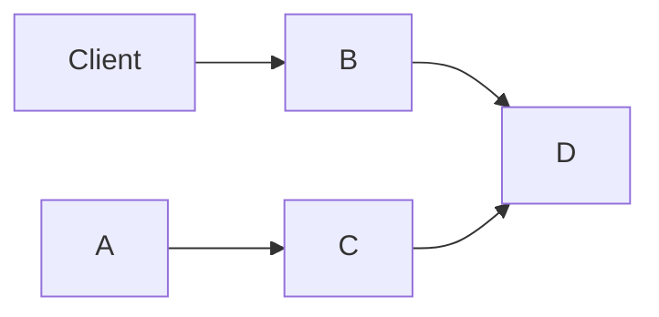

# What Does It Take to Make a Server Mastodon-Compatible?

_2022-12-25_ by [Zain Hoda](/)

## Motivation

I'm working on an [app](https://bazog.com/) (still very early stage) that happens to have the concept of [users](https://bazog.com/@decoder) and [posts](https://bazog.com/@decoder/EA32261154C54193B1F21443CBFF80C5). Some of our initial test users have expressed interest in the idea of "following" other accounts. I happen to have joined Mastodon recently so I was curious what it would take to just leverage that network for social functionality. I "livetooted" it [here](https://toot.io/@zain/109553219423059507). This post just recaps what I've learned. 

## Mastodon vs. ActivityPub

I knew that Mastodon was related to ActivityPub so I started reading the ActivityPub documentation. The documentation was a little overwhelming and I wasn't really sure whether Mastodon implements a superset or subset of ActivityPub. I was specifically interested in Mastodon-compatibility. My app serves video using [HLS](https://en.wikipedia.org/wiki/HTTP_Live_Streaming) and none of the current iOS apps support embedded HLS as a video media type.

## Inspecting HTTP Requests
So let's examine what HTTP requests are sent by Mastodon to a dummy server to see what's happening in the backend. 

## Searching for a User

Hello World

