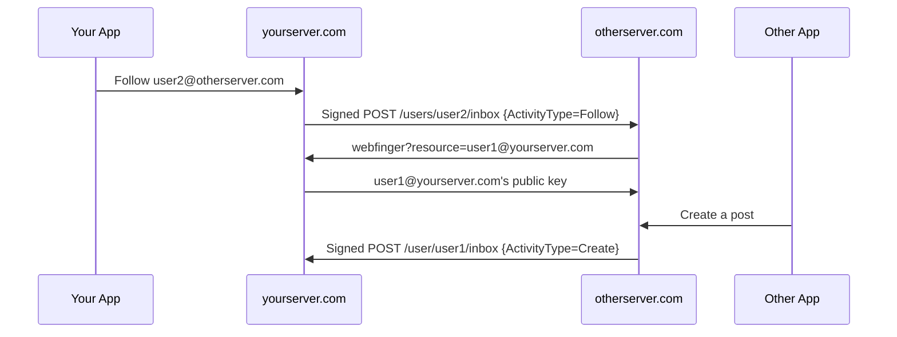

## Motivation

I'm working on an [app](https://bazog.com/) (still very early beta) that happens to have the concept of [users](https://bazog.com/@decoder) and [posts](https://bazog.com/@decoder/EA32261154C54193B1F21443CBFF80C5). Some of our initial test users have expressed interest in the idea of "following" other accounts. I happen to have joined Mastodon recently so I was curious what it would take to just leverage that network for social functionality. I "livetooted" it [here](https://toot.io/@zain/109553219423059507). This post just recaps what I've learned. 

## Mastodon vs. ActivityPub

I knew that Mastodon was related to ActivityPub so I started reading by the ActivityPub documentation. The documentation was a little overwhelming and I wasn't really sure whether Mastodon implements a superset or subset of ActivityPub. I was specifically interested in Mastodon-compatibility. Eventually I did find a resource that shows the overlap [here](https://activitypub.rocks/implementation-report/).

## Inspecting HTTP Requests
Let's examine what HTTP requests are sent by Mastodon to a dummy server to see what's happening in the backend. 

## Searching for a User
Let's see if we can figure out how Mastodon shows users. All Mastodon users are essentially in the form of an e-mail address prepended with an `@`, like `@user@domain.com` so let's search for a test user on our server.


No results as expected but let's see what happened on the backend.

### WebFinger


Note 2 things:
- It's asking for my user at `/.well-known/webfinger?resource=user@domain.com`, which contains some [JSON about the user](https://webfinger.net/). 
- It's not the *client app* that's making this request, it's actually the ***server*** that I'm logged into, in this case toot.io. Client apps don't seem to communicate directly with the end servers -- they only appear to talk to the server that you're logged into.

This is the webfinger response returned by my real Mastodon account:
```json
{
  "subject": "acct:zain@toot.io",
  "aliases": [
    "https://toot.io/@zain",
    "https://toot.io/users/zain"
  ],
  "links": [
    {
      "rel": "http://webfinger.net/rel/profile-page",
      "type": "text/html",
      "href": "https://toot.io/@zain"
    },
    {
      "rel": "self",
      "type": "application/activity+json",
      "href": "https://toot.io/users/zain"
    },
    {
      "rel": "http://ostatus.org/schema/1.0/subscribe",
      "template": "https://toot.io/authorize_interaction?uri={uri}"
    }
  ]
}
```

### Host Meta
Now somewhat by mistake, I also found out that if you don't prepend the username with an `@`, then there's an additional request made to the server:


It's asking for information about the server at `/.well-known/host-meta`. Trying this for a real server returns a short XML document:

```xml
<?xml version="1.0" encoding="UTF-8"?>
<XRD xmlns="http://docs.oasis-open.org/ns/xri/xrd-1.0">
  <Link rel="lrdd" template="https://toot.io/.well-known/webfinger?resource={uri}" />
</XRD>
```

This just reveals the URL format of the webfinger.

## The User Page
I implemented the WebFinger on my dummy site and tried the search again. 


Now the next request we're getting is to the `/users/{username}` endpoint. Let's see what that returns for my real profile:


Wait, what? This is an HTML page. I tried all the links to see if maybe there's on more hop that the Mastodon server is making to get.

## Accept: application/activity+json
After examining the request that came in to my `/users/test`, I found that there was a header of `Accept: application/activity+json`. So let's try that on my real profile again:


Alright, now there's some substance here. Next, I implemented this on my dummy server:

## Implementing the User Page


Some information contained on the user page:
- Links to information about followers, following, featured posts, and featured tags
- Links to the inbox and outbox, which are really what differentiate ActivityPub from something like RSS
- Name and Description
- Profile Picture
- Properties, which many people use for links to GitHub profiles, etc.
- ***Public Key*** (this will be important later)

## The User Profile 

Searching for the user again works and the profile is clickable to reveal the properties we set:


## Profile Requests

After clicking on the profile, these additional requests are made to the server. And yes, I did realize at this point that `collections` was misspelled.


## Stub Implementations
I took a look at my real profile and implemented some stub handlers to return things like followers:


## Fake Follower Counts
Now that we've implemented the additional endpoints, there's extra metadata showing up in the profile:


Note that I could have put any number here. It would not surprise me at all if in the future certain servers fake the follower counts for some or all of their users.

## Outbox
Next up was the outbox:


It has:
- The number of posts for the user
- The first page of the list of posts
- The last page of the list of posts

## Post Count
The outbox seems to control the post count  that shows up on the profile:


## The Inbox
The real power of Mastodon/ActivityPub comes from the Inbox, which is able to "accept" the following `ActivityType`s:
- Accept
- Add
- Announce
- Arrive
- Block
- Create
- Delete
- Dislike
- Flag
- Follow
- Ignore
- Invite
- Join
- Leave
- Like
- Listen
- Move
- Offer
- Question
- Reject
- Read
- Remove
- TentativeReject
- TentativeAccept
- Travel
- Undo
- Update
- View

### Authentication
Mastodon is able to do this because the webfinger has the user's public key and the server is able to sign requests to "verify" that the request came from the user. 

In practice, this verification is just verifying that the request came from the other server but not really the individual user. The server holds all the private keys so it could theoretically act as any user on it.




## Business Logic
The rest is now business logic of what to do you receive all the various `ActivityType`s.

## Is it worth it?
I've been having a lot of fun using Mastodon these past few weeks and it's been interesting to see the user growth. Having gone through this exercise, I do now see a lot of attack vectors for spam and general fraudulent behavior by server operators. I'll cover those issues in a separate post. I'm not yet sure when these issues will come up or how they'll be dealth with because most of the players in the Fediverse so far have been enthusiasts. For now I'll probably take a wait-and-see approach before implementing all the business logic. 
